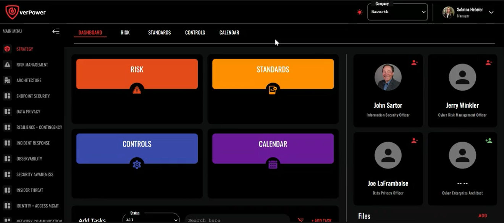
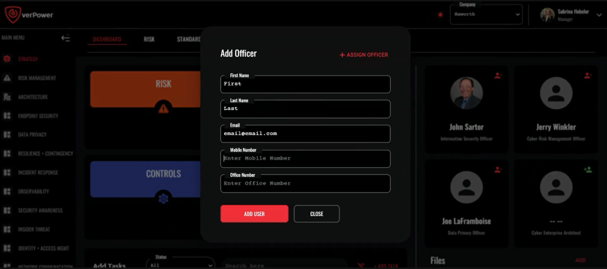
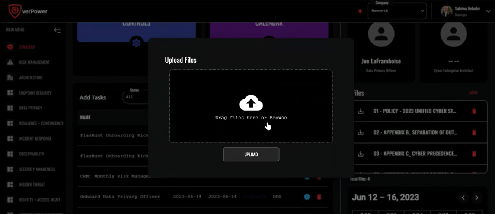
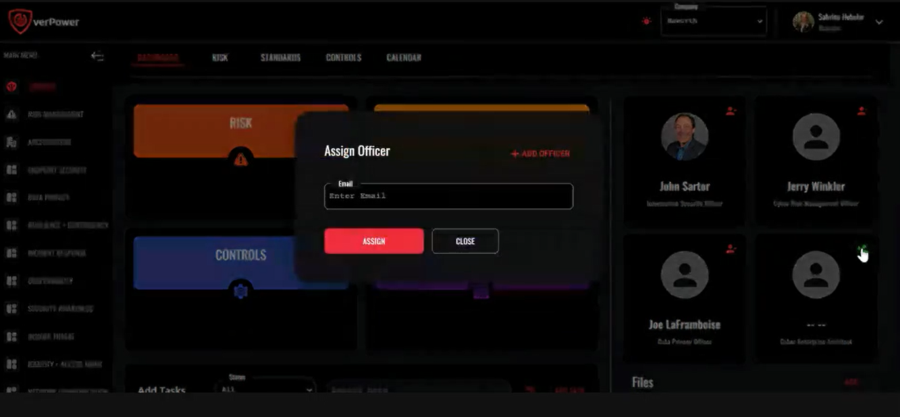
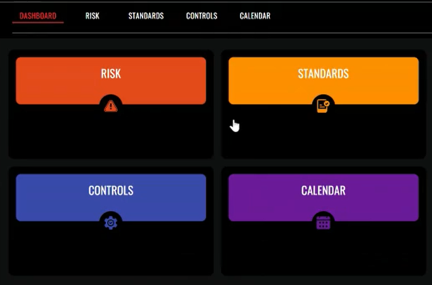

# Flash Hunt Platform - Strategy Module Dashboard

- [Flash Hunt Platform - Strategy Module Dashboard](#flash-hunt-platform---strategy-module-dashboard)
    - [Introduction](#introduction)
    - [Dashboard Overview](#dashboard-overview)
    - [Quick Links](#quick-links)

### Introduction

The Strategy Module's purpose is to provide an overview of the organization's annual cyber strategy. It includes the following components:

- **Risk tolerances:** Defines the organization's acceptable levels of risk.
- **Regulatory burdens:** Identifies regulatory requirements and compliance obligations.
- **Controls:** Outlines the necessary security controls and measures.
- **Programs:** Describes the programs required for effective cyber risk management.
- **Annual calendar:** Lists events and milestones to guide progress throughout the year.

### Dashboard Overview

Upon logging into the dashboard for the first time, users need to complete the following steps:

1. **Add Program Officers**

   

   On the right-hand side, click on the green person icon (+) to add program officers, including the Information Security Officer, Cyber Risk Management Officer, Data Privacy Officer, and Cyber Enterprise Architect. Users can either enter the officer's email address if they already exist in the system or add a new officer by providing their information (first name, last name, email address, mobile number, and office number). The tile will update with the officer's name once added.

2. **Add Strategy Files**
   

   Add files related to the organization's strategy, such as policies, budget, or annual workforce development plan. Click on "Add" and either drag files into the box or select files from the system to upload. The uploaded files will appear in the files section.

3. **Use Task Management**
   

   The task list provides a way to assign tasks, meetings, or other needs to program officers or users of the system. To add a new task, select "Add Task" and enter the task name, status (New, In Process, At Risk, Completed, or Cancelled), start date, end date, attachments (meeting agendas, minutes, etc.), and any relevant notes. Assign the task to the appropriate officer from the provided list (Information Security Officer, Cyber Risk Management Officer, Data Privacy Officer, or Cyber Enterprise Architect). The task will then appear in the task list and also in the calendar at the bottom right-hand corner.

### Quick Links

The tiles on the dashboard are quick links to other tabs below. While we won't cover them in this article, please refer to the documentation to explore those sections further.

That concludes this overview of the Strategy Module Dashboard. Feel free to reach out if you have any questions. Thank you!
